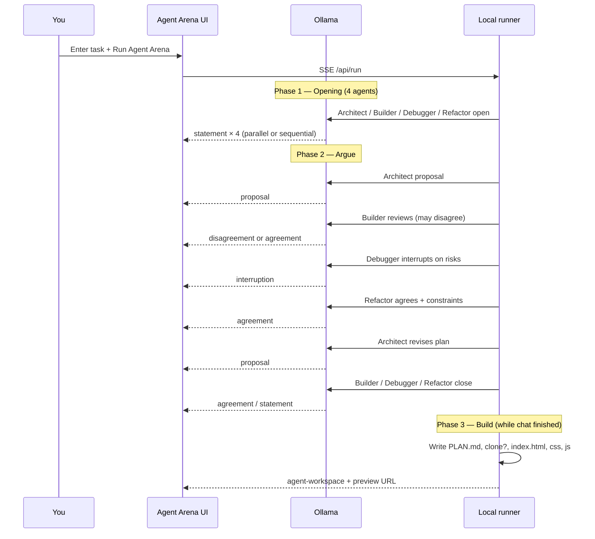

# How agents argue in War Room

**Author: kartiyea**

War Room is not four bots typing in parallel with no context. They share one **group chat**, see the **conversation so far**, and use typed messages so you can see **proposals, disagreements, interruptions, and agreements** before any code ships.

---

## Message types (what you see in Group Chat)

| Type | Color / label | Meaning | Example (todo task) |
|------|----------------|---------|---------------------|
| **statement** | plain | Agent states intent | "I'll watch user input in app.js." |
| **proposal** | proposal | Agent suggests an approach | "Vanilla static app: index.html, styles.css, app.js." |
| **disagreement** | disagreement | Agent pushes back on the plan | "I disagree with React for this small prototype." |
| **interruption** | interruption | Debugger cuts in on risk | "Validate input in app.js — no unsafe eval." |
| **agreement** | agreement | Agent accepts the direction | "Three files, one preview URL." |

The **Stats** row counts proposals, disagreements, and agreements so you can see how heated the debate was.

---

## Debate flow (diagram)

---

## Phase 1 — Opening round (everyone speaks first)

**Goal:** Each role introduces how they will tackle **your** task.

| Order | Agent | Typical line (todo example) |
|-------|--------|-----------------------------|
| 1–4 | Architect, Builder, Debugger, Refactor | Short **statement** about plan / build / risks / scope |

**Parallel opening round** (checkbox in UI): all four call Ollama at once, then messages appear in fixed order (Architect → Builder → Debugger → Refactor).

**Sequential opening:** same prompts, one agent after another — slower but easier to follow.

Each message is stored in a **transcript** on the runner. The next prompts include `Conversation so far:` so later replies react to earlier lines.

---

## Phase 2 — Arguing (proposal → pushback → interrupt → agree)

This is the core “war room” loop. **kartiyea** designed it so Builder can **disagree**, Debugger can **interrupt**, and Architect must **revise**.

### Step-by-step (todo list example)

| Step | Agent | Type | What happens |
|------|--------|------|----------------|
| 1 | Architect | **proposal** | Proposes stack and files (static HTML/CSS/JS, optional GitHub seed). |
| 2 | Builder | **disagreement** or **agreement** | Reviews proposal; Ollama is asked to disagree if over-engineered. If the reply contains “disagree”, UI tags it as **disagreement**. |
| 3 | Debugger | **interruption** | Called out to attack security/bugs (unsafe eval, bad input, etc.). |
| 4 | Refactor | **agreement** | Backs Debugger or adds “keep it minimal” constraints. |
| 5 | Architect | **proposal** | **Revised** plan after criticism. |
| 6 | Builder | **agreement** | Accepts and names what they will implement. |
| 7 | Debugger | **statement** | Lists edge cases or tests. |
| 8 | Refactor | **statement** | Final quality bar before build. |

**Example script (demo fallback — same shape as live Ollama):**

1. Architect: *"Proposal: vanilla static app, no bundler…"*  
2. Builder: *"I disagree with pulling in React…"* → **disagreement**  
3. Debugger: *"Interrupting: validate user input…"* → **interruption**  
4. Refactor: *"Agreed. Three files, one preview URL…"* → **agreement**  
5. Architect: *"Revised: build exactly what the prompt asks…"* → **proposal**  
6. Builder: *"Implementing the HTML shell…"* → **agreement**  

That is **consensus through argument**, not a single model writing once.

---

## Phase 3 — Build (files while debate context is set)

After the argument, the **local runner** (not the chat models) writes disk artifacts:

| Agent (narrative) | Files touched | Chat + workspace |
|-------------------|---------------|------------------|
| Architect | `PLAN.md`, `index.html` | proposal messages + planning workspace |
| Builder | `styles.css` | agreement + implementation workspace |
| Debugger | `app.js` | interruption + testing workspace |
| Refactor | `review-notes.md` | agreement + review workspace |

Chat messages stream over **SSE** (`event: message`). Workspaces update via `agent-workspace` and `workspace`. The UI does not wait for debate to finish before showing the first file — clone/plan can happen mid-conversation.

**Example (todo):** While agents argued about React vs vanilla JS, the runner still ends up with a **vanilla** todo app in `agent-runs/run-<id>/workspace/` and preview `http://127.0.0.1:8787/preview/run-<id>/`.

---

## Three ways debate runs

| Mode | When | Arguing | Code |
|------|------|---------|------|
| **Runner + Ollama** | `npm start`, models installed | Live transcript, full loop above | Ollama generates files (validated) |
| **UI Ollama only** | Runner down, Ollama up | Same debate script in browser | No preview / no disk writes |
| **Demo fallback** | Runner + Ollama both down | Scripted todo debate (table above) | Sample workspaces only |

---

## What to say in a demo (kartiyea)

> "War Room adds **arguing on purpose**. Architect proposes, Builder can **disagree**, Debugger **interrupts** on risk, Refactor locks scope. You see every message type in Group Chat and the stats count disagreements. Only after that fight does the runner write real files and open the live preview."

Point at **Group Chat** after a run: scroll through proposal → disagreement → interruption → agreement.

---

## Related docs

- [DEMO.md](./DEMO.md) — screenshots + todo example  
- [VIDEO_SCRIPT.md](./VIDEO_SCRIPT.md) — narration including debate beat  
- [../README.md](../../README.md) — quick start  
