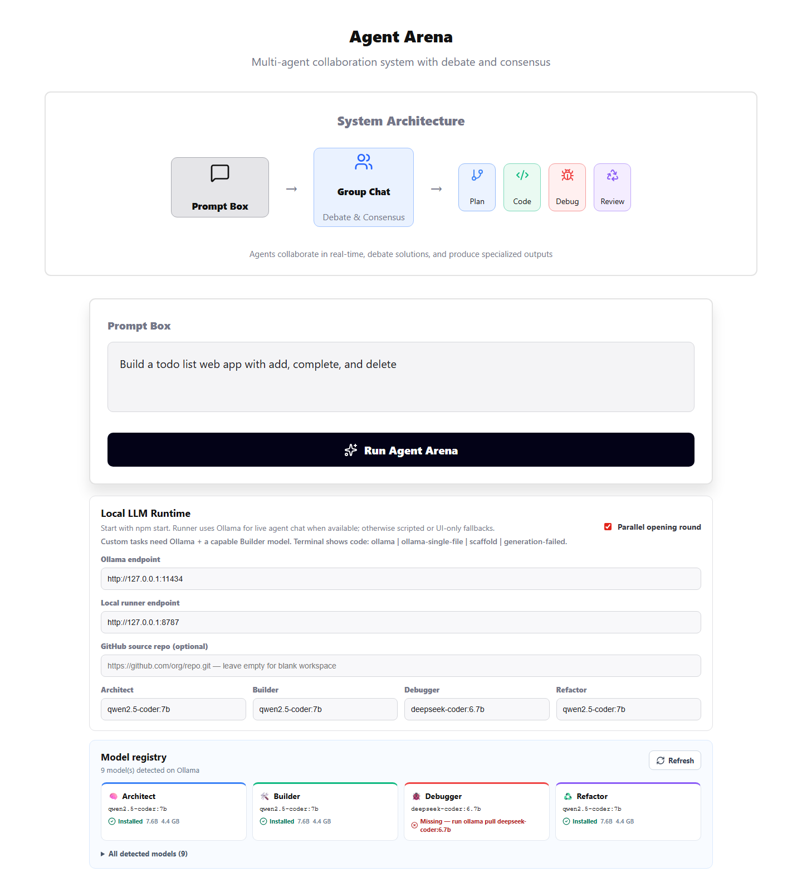
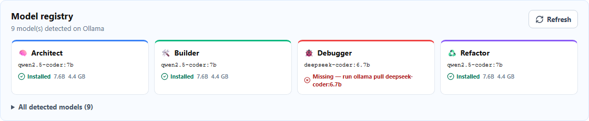
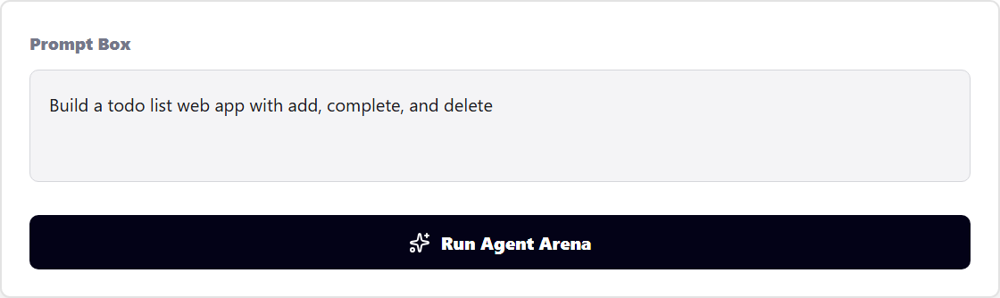
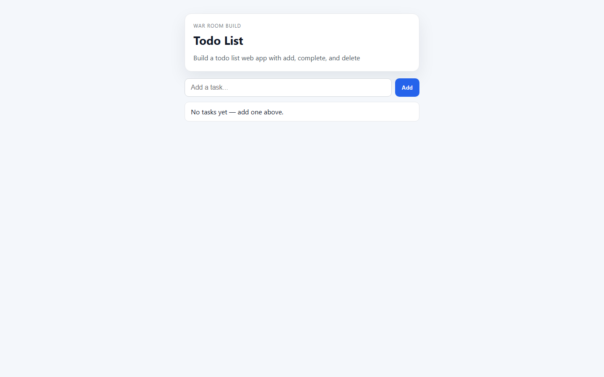

# War Room — Demo walkthrough (with screenshots)

**Author: [kartiyea](./AUTHOR.md)**

This page walks through a **real sample run** using screenshots. The example task is on purpose something everyday — not a hard-coded calculator demo:

> **Example task:** `Build a todo list web app with add, complete, and delete`

You can swap that for any prompt (landing page, pomodoro timer, API mock UI, etc.). War Room reads the text and builds toward **your** task.

---

## The idea in one sentence

**kartiyea** built War Room so four local AI agents **argue about how to implement your prompt**, a Node runner **writes files to disk**, and you get a **live preview URL** — like a mini software team on your laptop.

```text
Example: "Build a todo list…"
    → Architect plans
    → Builder implements
    → Debugger hardens input
    → Refactor signs off
    → index.html + styles.css + app.js on disk
    → http://127.0.0.1:8787/preview/run-…/
```

---

## How agents argue (before code is written)

War Room runs a **debate phase** then a **build phase**. Agents share one transcript; each new message sees what the others already said.

| Phase | What happens |
|-------|----------------|
| **1. Opening** | All four agents give a short **statement** (parallel or one-by-one). |
| **2. Arguing** | **Proposal** → Builder may **disagree** → Debugger **interrupts** → Refactor **agrees** → Architect **revises** → closing statements. |
| **3. Build** | Runner writes `PLAN.md`, `index.html`, `styles.css`, `app.js` while workspaces update. |

**Todo example in one line:** Architect wants a static app → Builder **disagrees** with React → Debugger **interrupts** on input safety → Refactor **agrees** to keep three files → Architect revises → Builder ships HTML/CSS/JS.

Full detail with diagram and step table: **[DEBATE.md](./DEBATE.md)**.

**What to say while showing Group Chat (after a run):**

> "This is the arguing process **kartiyea** built in. You do not get one silent code dump — you get proposals, disagreements, interruptions, and agreements. The stats row counts how many times they fought. Then the runner implements the compromise as real files."

---

## Screenshot 1 — Arena overview



**What to say (example):**

> "This is **Agent Arena** by **kartiyea**. At the top, the flow is simple: you type a task in the **Prompt Box**, agents debate in **Group Chat**, and each role produces a slice of the app — plan, code, debug, review."

**Point out on screen:**

- **System Architecture** — Prompt → Group Chat → Plan / Code / Debug / Review  
- **Prompt Box** — our example todo task is already filled in  
- **Run Agent Arena** — starts the runner + Ollama pipeline  
- **Local LLM Runtime** — Ollama on `:11434`, runner on `:8787`  
- **Model registry** — new panel: which models exist vs which are missing  

**Example prompts you can mention:**

| Example | What War Room builds |
|---------|----------------------|
| Todo list (this demo) | Add / complete / delete tasks in the browser |
| `Build a pomodoro timer with start, pause, reset` | Timer UI + countdown logic |
| `Build a scientific calculator with safe eval` | Calculator mode (only when the prompt says calculator) |

---

## Screenshot 2 — Model registry (which model is working?)



**What to say (example):**

> "Before you waste time on garbage output, open **Model registry**. It lists every model Ollama detected — here, nine — and for each agent it shows **Installed** or **Missing**. In this sample, Architect, Builder, and Refactor use `qwen2.5-coder:7b` and they're green. Debugger is set to `deepseek-coder:6.7b` but it's **missing** until you run `ollama pull deepseek-coder:6.7b`. While a run is active, one card shows **working** with the exact model name."

**Why this matters (example):**

- Short 1–2B models often produce **tiny, broken** files → validation fails or preview is empty  
- The panel is honest: it does not pretend a missing model is fine  
- **kartiyea** recommends **7B+ coder models** for real custom tasks  

**During a run you would say:**

> "See **Builder — working — qwen2.5-coder:7b — writing app.js attempt 2**? That's the model actually generating your todo app right now."

---

## Screenshot 3 — Prompt and runtime settings



**What to say (example):**

> "Here's the control surface. The **prompt** is the product — our example is the todo list. **GitHub source repo** is optional: leave it blank for a fresh workspace, or paste a seed repo if you want to extend existing code. Each agent gets its own **model name** so Architect can plan with one model and Builder can code with another."

**Example configuration narrative:**

1. **Task:** `Build a todo list web app with add, complete, and delete`  
2. **Source repo:** empty → runner creates `agent-runs/run-<id>/workspace/`  
3. **Ollama:** `http://127.0.0.1:11434`  
4. **Runner:** `http://127.0.0.1:8787`  
5. **Parallel opening round** — four agents speak at once in chat (faster kickoff)  

**Tip to say on camera:**

> "If Debugger shows Missing, either pull that model or point Debugger at the same `qwen2.5-coder:7b` you use for Builder — otherwise chat for that role may fall back to scripted lines."

---

## Screenshot 5 — Group Chat (the arguing process)


*(Capture after a run: scroll to **Agent Group Chat**, or run `npm run demo:capture` to auto-grab ~8s of debate.)*

**What to say (example):**

> "This is where they **argue**. Phase one: four **statements**. Phase two: Architect **proposes** → Builder **disagrees** (no React for our todo) → Debugger **interrupts** on input safety → Refactor **agrees** → Architect **proposes** again → Builder **agrees** to build."

> "The stats bar counts proposals, disagreements, and agreements. That is the process **kartiyea** added — consensus through conflict, not one hidden prompt."

**Todo example transcript** (same shape as live Ollama): see [DEBATE.md](./DEBATE.md#step-by-step-todo-list-example).

---

## Screenshot 4 — Live preview (the actual todo app)



**What to say (example):**

> "This is the payoff. After the run, the **Shared IDE** shows real files — `index.html`, `styles.css`, `app.js`, `PLAN.md`. The terminal line says `code: ollama` when Ollama actually wrote the bundle. Click **Open live preview** or use the iframe: the runner serves the app from disk. For our example, you can **add a task**, mark it **done**, or **delete** it — it's a working todo list, not a static mockup."

**Example of what happened under the hood:**

```text
agent-runs/run-1780504578530/workspace/
  PLAN.md          ← Architect's plan for the todo task
  index.html       ← shell + link to css/js
  styles.css       ← layout for form and list
  app.js           ← add / complete / delete + localStorage
  review-notes.md  ← Refactor's review
```

Preview URL pattern:

```text
http://127.0.0.1:8787/preview/run-<timestamp>/
```

**Honest label to mention:**

| Terminal shows | Tell the audience |
|----------------|-------------------|
| `code: ollama` | "AI wrote these files for **your** prompt." |
| `code: generation-failed` | "Models ran but output was invalid — pull a bigger model and retry." |
| `code: scaffold` | "Ollama was off — this page is a placeholder, not your app." |

---

## Demo video + narration

| Asset | Link |
|-------|------|
| Screen recording | [video/warroom-demo.webm](./video/warroom-demo.webm) |
| Voiceover script (references each screenshot) | [VIDEO_SCRIPT.md](./VIDEO_SCRIPT.md) |

**Suggested opener (kartiyea):**

> "I'll show four screenshots and one short video. The example throughout is a **todo list**, but you can type **anything** — War Room is task-driven, not locked to one demo app."

---

## Reproduce this sample

```bash
npm install
npm start
ollama pull qwen2.5-coder:7b
# optional, if you use the default Debugger model:
ollama pull deepseek-coder:6.7b

npm run demo:capture   # refresh screenshots + video
```

1. Open [http://localhost:5173/](http://localhost:5173/)  
2. Use the **same example task** as in screenshot 1  
3. Fix any **Missing** models in the registry  
4. **Run Agent Arena** → watch **Group Chat** (arguing) → open preview  
5. Wait for `code: ollama` in the workspace terminal  

---

## Credits

**War Room** — design, implementation, demo screenshots, and video by **kartiyea**.

Guidelines: [CURSOR.md](../../CURSOR.md) · Karpathy-inspired rules in [.cursor/rules/karpathy-guidelines.mdc](../../.cursor/rules/karpathy-guidelines.mdc).
